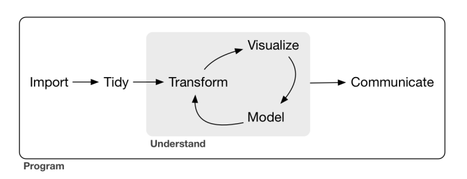

&nbsp;

```{r setup, include=FALSE}
library(learnr)
knitr::opts_chunk$set(echo = FALSE)
```

## Objetos en R

Existen diferentes tipos de objetos en R, algunos de los más importantes:

* Vectores: podemos generar listas con la función `c()` o con el operador `:`, entre otros.
* Matrices: la función `matrix()` permite crear objetos de tipo matriz.
* Data.frames: las bases de datos creadas internamente (mediante `data.frame()`) o importadas desde archivos externos suelen ser de este tipo.
* Listas: la función `list()`permite generar objetos de tipo lista.

### Ejercicio 1

Queremos generar una secuencia de 100 números como un vector. El vector debe iniciarse en 2 y el incremento debe ser de 1 unidad.

Escribe el código de R:

```{r seq100, exercise=TRUE, exercise.eval=TRUE}

```

```{r seq100-hint}
# Genera la secuencia con el operador :
  
```

```{r seq100-solution}
2:101 # Forma 1
seq(2,length.out=100) # Forma 2
```

### Ejercicio 2

Comprueba el tipo de objeto que devuelve el siguiente código.

Utiliza una función ya existente que nos permita saber el tipo de objeto de R que es `mod`:

```{r objLM, exercise=TRUE, exercise.lines = 5}
x <- -100:100/10
y <-1.3*x - 1.2*x^2 + rnorm(length(x),mean=12,sd=3)
DF <- data.frame(VD=y,VI=x)
mod <- lm(VD~VI,data=DF)
```

```{r objLM-hint}
# Utiliza la función str()
  
```

```{r objLM-solution}
str(mod)  
```

&nbsp;

Podemos generar vectores y secuencias con funciones como `c()` o `rep()`. En el primer caso podemos encadenar valores numéricos o carácter separados con comas, mientras que en el segundo podemos repetir un valor o secuencia de acuerdo a un determinado patrón, por ejemplo, `rep(c(1,2),c(1,2))` generaría el vector `[1] 1 2 2`.

### Ejercicio 3

Genera un vector,`estudiantes`, con las puntuaciones de 5 estudiantes, `84 74 67 90 78`, mediante una función de R:

```{r vecR, exercise=TRUE, exercise.blanks = "___+"}
estudiantes <- ____
```

```{r vecR-hint}
# Utiliza la función c()
  
```

```{r vecR-solution}
estudiantes <- c(84,74,67,90,78)
```

### Ejercicio 4

Genera un vector categórico de tamaño 60 en el que se ha generado al azar etiquetas con dos posibles valores: `Control` y `Tratamiento`. Llama al objeto `grupo`:

```{r vecAleat, exercise=TRUE}
grupo <- c('Control','Tratamiento')
```

```{r vecAleat-hint}
# Utiliza la función rep() combinada con sample()
# Si quieres que siempre se obtenga el mismo
# resultado debes fijar la semilla aleatoria: set.seed()  
```

```{r vecAleat-solution}
set.seed(123)
grupo <- sample(rep(c('Control','Tratamiento'),each=30))
```

### Ejercicio 5

El anterior objeto era de tipo carácter (`chr`) pero en general nos interesará tratarlo como objeto de tipo factor. Genera un nuevo objeto `grupo2` Para ello utliza la función `factor()` y compáralo con el objeto del ejercicio anterior

```{r factor, exercise=TRUE, exercise.blanks='___+',exercise.setup = 'vecAleat'}
set.seed(123)
grupo <- sample(rep(c('Control','Tratamiento'),each=30))
grupo2 <- ___
```

```{r factor-hint}
# Utiliza la función str()
```

```{r factor-solution}
grupo2 <- factor(grupo)
str(grupo)
str(grupo2)
```

## Importación de bases de datos con R

Podemos importar bases de datos al entorno de trabajo de R desde varios formatos.

* Desde un archivo de texto: la función `read.table()`. 

* Desde un archivo de SPSS: hay varios paquetes que permiten importar archivos ***sav**. Aquí utilizaremos el paquete `haven` y la función `read_sav``.

* Desde un archivo de Excel: la función `read_xlsx` del paquete `readxl` permite importar archivos de este tipo.

### Ejercicio 1

Crea un objeto llamado `df1` a partir de la importación del archivo **visualmemory.txt** que se encuentra en eldirectorio **data**. Una vez importado, muestra las primeras 3 filas.

```{r readtable, exercise=TRUE, exercise.blanks = "___+"}
df1 <- read.table(____)
```

```{r readtable-hint}
# Utiliza la ayuda de read.table() para conocer los 
# argumentos de la función
# La función head() te permite imprimir las primeras
# filas
```

```{r readtable-solution}
df1 <- read.table('data/visualMemory.txt')
head(df1,n=3)
```

### Ejercicio 2

Importa el archivo **Database_PANAS.sav** que se encuentra en el directorio **data** y genera un data.frame llamado `df2`. Reporta el número de variables, observaciones y valores perdidos de la base de datos.

```{r readsav, exercise=TRUE, exercise.blanks = "___+"}
df2 <- haven::read_sav(____)
```

```{r readsav-hint}
# Utiliza la ayuda de la función read_sav para
# conocer los argumentos de la función
# Prueba las funciones dim() y summary() 
```

```{r readsav-solution}
df2 <- haven::read_sav('data/Database_PANAS.sav')
dim(df2)
summary(df2)
```

### Ejercicio 3

Importa el archivo **visualMemory.xlsx** que se encuentra en el directorio **data** y genera un data.frame llamado `df3`. Reporta el número total de valores perdidos de la base de datos mediante una única instrucción.

```{r readxls, exercise=TRUE, exercise.blanks = "___+"}
library(readxl)
df3 <- read_xlsx(____)
df3
```

```{r readxls-hint}
# Utiliza la función is.na() conjuntamente con la función
# sum()
```

```{r readxls-solution}
library(readxl)
df3 <- read_xlsx('visualMemory.txt')
sum(is.na(df3))
```

## Gestión de datos con R

Vamos a practicar ahora el acceso a elementos de distintas estructuras de datos (vectores, matrices, arrays, listas, data.frames).

* En primer lugar, podemos utilizar el operador `[]` para acceder a partes concretas de la estructura de datos.

* El operador `$` permite acceder a toda la variable de una base de datos.

* Equivalentemente, para tener acceso a una variable podemos utilizar el código: `['NOMBRE VARIABLE']`.

* Conviene conocer la función `with(BASEDATOS,INSTRUCCIÓN(VARIABLE))` pues nos puede ahorrar algo de código en algunas situaciones.

### Ejercicio 1

Accede a los siguientes valores del objeto `df2` creado en un ejercicio anterior:

- Elemento de la primera fila y la segunda columna.

- Elementos de la segunda fila.

- Elementos de las columnas 2 a 5.

```{r accesosav, exercise=TRUE, exercise.blanks="___+"}
df2 <- haven::read_sav('data/Database_PANAS.sav')
df2[___]
```

```{r accesosav-hint}
# Utiliza el operador []
# Ten en cuenta que un data.frame tiene 2 dimensiones
```

```{r accesosav-solution}
df2[1,2]
df2[2,]
df2[,2:5]
```

### Ejercicio 2

Imprime la variable `before` de la base de datos `df1` mediante el operador 

```{r opdolar, exercise=TRUE, exercise.blanks='___+'}
df1 <- read.table('data/visualMemory.txt')
___$___
```

```{r opdolar-hint}
# La estructura es BASE$VARIABLE
```

```{r opdolar-solution}
df1$before
```

### Ejercicio 3

Lleva a cabo la operación anterior pero combinando el operador `[]` con el nombre de la variable:

```{r accVar, exercise=TRUE,exercise.blanks="___+"}
df1 <- read.table('data/visualMemory.txt')
df1[___]
```

```{r accVar-hint}
# La estructura es BASE['VARIABLE']
```

```{r accVar-solution}
df1['before']
```

### Ejercicio 4

Imprime todas las variables de la base de datos `df2` cuyo nombre empiece por la letra `N`:

```{r accVars,exercise=TRUE,exercise.blanks='___+'}
df2 <- haven::read_sav('data/Database_PANAS.sav')
df2[___]
```

```{r accVars-hint}
# Utilizad la función colnames()
# Utilizad la función starsWith()
```

```{r accVars-solution}
df2[startsWith(colnames(df2),'N')]
```

## Funciones con R

Las funciones de R son un objeto esencial en el entorno. La estructura básica de éstas es la siguiente:

`NOMBRE <- function(ARGUMENTOS){
CUERPO DE LA FUNCIÓN
}
`

### Ejercicio 1
Vamos a crear una función que calcule la suma de cuadradados de un vector numérico mediante la siguiente fórmula: $\sum_{i=1}^nx_i^2$. Llamaremos a esta función `sumcuad` y la aplicaremos al objeto `VECT`:

```{r sumcuad,exercise=TRUE,exercise.blanks='___+'}
sumcuad <- function(___)
VECT <- 100:340
```

```{r sumcuad-hint}
# Necesitaremos un argumento correspondiente al vector numérico
# En el cuerpo de la función únicamente se debe elevar al cuadrado
# los valores y sumarlos
```

```{r sumcuad-solution}
sumcuad <- function(x){sum(x^2)}
sumcuad(VECT)
```

### Ejercicio 2

Modificad la función anterior para que calcule la suma de cuadrados de números pares. Es decir $\sum_{i=1}^nx_i^2·I_i$, donde $I=\begin{cases}I_i=1 \text{ si }  mod(x_i,2)=0\\ I_i=0 \text{ en otro caso}\end{cases}$. Llama a esta nueva función `sumcuad2` y aplícala de nuevo al vector `VECT`.

```{r sumcuad2, exercise=TRUE,exercise.blanks='___+'}
sumcuad2 <- function(___)
VECT <- 100:340
```

```{r sumcuad2-hint}
# Utiliza el operador %% que en R 
# se corresponde con la función módulo
```

```{r sumcuad2-solution}
sumcuad2 <- function(x){
  sum(x[!x%%2]^2)
}
sumcuad2(VECT)
```

## Estructuras condicionales

El uso de estructuras condicionales es muy habitual en la ciencia de datos pues nos permiten:

* Filtrar observaciones de una estructura de datos

* Ejecutar bloques de código en función del cumplimiento de una o varias condiciones

* Modificar el comporatamiento de una función en función del tipo de dato o la fase del proceso en el que se encuentre...

En R encontramos distintas estructuras condicionales, algunas de las más importantes:

* IF/ELSE: las estructuras SI/ENTONCES permiten evaluar 1 o más condiciones.
* `ifelse()`: es una versión vectorizada que resultad de gran utilidad muchas ocasiones

Para especificar las distintas condiciones que puedan resultar de utilidad deberemos utilizar en muchos casos operadores lógicos:

* Operadores Y, O y NO: `&`, `|`, y `!`, respectivamente.

* Igualdad: se utiliza `==`.

* Desigualdad: se utiliza `!=`

* Mayor o igual que: se utiliza `>=`.

* Menor o igual que: se utiliza `<=`.

* Otro operador que puede resultar de utilidad es el operador EN: `%in%`.

### Ejercicio 1
Supongamos que en un juego de dados, se gana siempre que al lanzar simultáneamente tres dados su suma sea superior a 10 puntos. Vamos a escribir una función que simule el juego "Suma tres dados":

```{r suma3dados, exercise=TRUE,exercise.blanks='___+'}
suma3dados <- function(___)
```

```{r suma3dados-hint}
# Utiliza sample(1:6,3,replace=TRUE) para simular
# el lanzamiento de los 3 dados
# Luego evalúa la suma con el condicional if else
```

```{r suma3dados-solution}
suma3dados <- function(){
  suma <- sum(sample(1:6,3,replace=TRUE))
  msg <- paste0('La suma es ',suma)
  msg2 <- if(suma>10){', has ganado.'} else {', has perdido.'}
  paste0(msg,msg2)
}
suma3dados()
```

### Ejercicio 2

Simula ahora el lanzamiento de una moneda, mediante la función `runif()` (ver la ayuda de la función para saber cómo funciona). En este caso, si el valor generado es menor que 0.5 se considerará que se ha obtenido una cara y si el valor es mayor o igual se considerará que se ha obtenido una cruz. Genera 500 lanzamientos y asigna la etiqueta "cara/cruz" a cada resultado mediante la función `ifelse()`. Llama al vector `resultados`. ¿Qué esperas obtener si la moneda no está trucada?

```{r caracruz, exercise=TRUE,exercise.blanks='___*'}
resultados <- ifelse(___)
```

```{r caracruz-hint}
# Para conocer la distribución resultante puedes utilizar
# la función table() sobre el vector resultados
```

```{r caracruz-solution}
resultados <- ifelse(runif(500)<.5,'Cara','Cruz')
table(resultados)
```

## Estructuras iterativas

Existen dos estructuras iterativas básicas en R que deben conocerse: `for` y `while`:

* Las estructuras `for` permiten repetir una determinada tarea un número predefinido de veces pues debemos especificar el inicio y el final de la secuencia de iteraciones. La estructura es: `for(SECUENCIA){CÓDIGO A ITERAR}`. En general la secuencia se puede declarar como `ÍNDICE in INICIO:FINAL`.

* La estructura `while` permite repetir una secuencia de acciones mientras se cumple la condición, en este caso no sabemos a priori el número de veces que se va a iterar. La estructura general es: `while(CONDICIÓN){CÓDIGO A ITERAR}`

### Ejercicio 1

Crea un función que cuente las veces que una cadena de caracteres del vector que se presenta a continuación (vector `VECT`) contiene una 'a'

```{r forex, exercise=TRUE,exercise.blanks='___+'}
VECT <- c('Barcelona','Valencia','Gijón','Cartagena','Guadalajara')

res <- vector()
for(___){
  res[___] <- ___
}
res
```


```{r forex-hint}
# La secuencia debe relacionarse con el tamaño de VECT
# strsplit() permite separar los caracteres de la cadena
# En cada i-ésima iteración suma el número de caracteres iguales
# al caracter 'a' y asígnalo al i-ésimo elemento de res
```

```{r forex-solution}
VECT <- c('Barcelona','Valencia','Gijón','Cartagena','Guadalajara')

res <- vector()
for(i in 1:length(VECT)){
  res[i] <- sum(strsplit(VECT[i],'')[[1]]=='a')
}
res
```

### Ejercicio 2

Inserta en la estructura `while` la condición que el número generado al azar sea más grande que `-6`. ¿Cuántas iteraciones necesita para finalizar? ¿Cómo podemos acortar el número de iteraciones?

```{r whileex, exercise=TRUE, exercies.blanks='___+'}
cont <- 0
numero <- rnorm(1)
while(___){
  numero <- ___
  cont <- ___
}
```


```{r whileex-hint}
# Utiliza una condición lógica en while()
# Actualiza en cada iteración el número aleatorio
# y el contador de iteraciones
```

```{r whileex-solution}
cont <- 0
numero <- rnorm(1)
while(numero>(-6)){
  numero <- rnorm(1)
  cont <- cont + 1
}
```


## Introducción a tidyverse

tidyverse es un conjunto de paquetes que posibilita las principales tareas en todo proyecto de Ciencia de Datos. En el núcleo del tidyverse encontramos los paquetes: readr, tidyr, dplyr y ggplot2.

Estos paquetes comparten una filosofía de diseño, sintaxis y estructuras de datos similares.

Los paquetes de tidyverse trabajan con dos estructuras de datos básicas: data.frames y tibbles.

&nbsp;

```{r warning=FALSE,message=FALSE}
library(tidyverse)
```

### Modelo de Ciencia de Datos

Seguiremos el modelo propuesto por Wickham y Grolemund (2023):



Os recomiendo encarecidamente echarle un vistazo a este [MARAVILLOSO libro libre](https://r4ds.hadley.nz/).

tidyverse es un conjunto de paquetes que posibilita las principales tareas en todo proyecto de Ciencia de Datos. En el núcleo del tidyverse encontramos los paquetes: `readr`, `tidyr`, `dplyr` y `ggplot2`.

Estos paquetes comparten una filosofía de diseño, sintaxis y estructuras de datos similares.

Los paquetes de tidyverse trabajan con dos estructuras de datos básicas: `data.frame`s y `tibble`s.

&nbsp;


### Lectura de datos con readr

La funcioń `read_csv()` incluida en `readr` nos permite cargar archivos de tipo `csv` (valores separados por comas).

### Ejercicio 1

Carga la base de datos disponible en https://raw.githubusercontent.com/deepstartup/COVID-19-Community-Mobility-Dataset/master/world_mobility_with_covid_infection_count.csv mediante `read_csv()`, llama al nuevo objeto `datosCOVID` e inspecciona su estructura.

```{r readr, exercise=TRUE}
datosCOVID <- read_csv(file='___')
```

```{r readr-hint}
# Consulta la ayuda de la función read_csv()
# Recuerda la función str()
```

```{r readr-solution}
datosCOVID <- read_csv(file='https://raw.githubusercontent.com/deepstartup/COVID-19-Community-Mobility-Dataset/master/world_mobility_with_covid_infection_count.csv')

datosCOVID |>  str()
```

Recordad que existen otros paquetes como `haven` o `readxl` que permiten la importación de otros tipos de archivos.

### El paquete magrittr

En el ejemplo anterior he utilizado un "pipe" básico (incluído en R > 4.1, https://www.r-bloggers.com/2021/05/the-new-r-pipe/):`|>`. Los pipes son herramientas muy útiles para expresar una secuencia de tareas. El paquete `magrittr` incluye otro pipe muy utilizado `%>%`. El paquete se carga automáticamente al cargar el tidyverse en la sesión de trabajo.


* Por qué utilizar pipes?

  - Permite estructurar una secuencia de operaciones de izquierda a derecha en lugar de dentro a fuera.
  
  - Es una buena forma de evitar anidamiento en la llamada de funciones.
  
  - Minimiza el uso de variables locales y la definición de funciones.
  
  - Facilita la incorporación de nuevos pasos a una secuencia ya creada.
  
### Ejercicio 1

Expresa la segunda instrucción mediante pipes.

```{r pipeex, exercise=TRUE, exercise.lines=5}
x <- c(0.109, 0.359, 0.63, 0.996, 0.515, 0.142, 0.017, 0.829, 0.907)

round(exp(diff(log(x))), 1)
```

```{r pipeex-hint}
# Extrae y combina los distintos elementos mediante
# pipes, desde dentro a fuera
```


```{r pipeex-solution}
x |>  log() |>  
  diff() |>  
  exp() |>  
  round(1)
```

&nbsp;

No se recomienda utilizar pipes cuando:

  - Sean necesarios 10 o más pasos para obtener un resultado.
  
  - Hay múltiples inputs y outputs.
  
  - Hay una dependencia compleja en la estructura (i.e no lineal) detrás de los cálculos a realizar.


### Organización de datos con tidyr

Se dice que un `data.frame` (o `tibble`) es *tidy* si cumple las siguientes condiciones:

* Cada variable está en una columna.

* Cada observación o caso ocupa una fila.

* Cada tipo de observación conforma una única tabla.


### Ejercicio 1

¿Esta base de datos es tidy?

```{r tidy1, exercise=TRUE}
table1
```

```{r tidy1-solution}
# Esta base de datos es tidy: intenta calcular, por ejemplo,
# la tasa de contagios: cases/population
```


### Ejercicio 2

¿Esta base de datos es tidy?

```{r tidy2, exercise=TRUE}
table2
```

```{r tidy2-solution}
# Esta base de datos no es tidy. De nuevo, intenta calcular
# la tasa de contagios: cases/population
```

### Ejercicio 3

¿Esta base de datos es tidy?

```{r tidy3, exercise=TRUE}
table3
```

```{r tidy3-solution}
# Esta base de datos no es tidy
```

### Ejercicio 4

¿Estas bases de datos son tidy?

```{r tidy4, exercise=TRUE}
table4a

table4b
```

```{r tidy4-solution}
# No son tidy.
```

&nbsp;

Algunas de estas bases de datos muestran, entre otros, dos de los problemas más comunes al trabajar con datos:

- Una variable está codificada a lo largo de múltiples columnas.

- Una observación está codificada a lo largo de múltiples filas.


### Pivotes: formato largo

Las funciones pivote permiten solventar estos problemas y preparar las bases de datos para que puedan ser usadas como entrada en el tidyverse.

&nbsp;

`Table4a` y`Table4b` son ejemplos de variables en múltiples columnas.

Podemos utilizar la función `pivot_longer` para solventar el problema:

```{r pivotL, exercise=TRUE}
td4a <- table4a |> 
  pivot_longer(c(`1999`, `2000`), names_to = "year", values_to = "cases")
td4a
```

Nótese que year y cases son nuevas variables, por lo que debe ir entre comillas. Haz lo mismo con la base de datos `table4b`.

```{r pivotL2, exercise=TRUE,exercise.blanks='___+'}
td4b <- ___
```

```{r pivotL2-hint}
# Llama a las nuevas variables year y populations
# recuerda que éstas deben ir entre comillas
```

```{r pivotL2-solution}
td4b <- table4b |>  
  pivot_longer(c(`1999`, `2000`), names_to = "year", values_to = "population")
td4b
```


Ahora podemos combinar ambas bases de datos en un único tibble:

```{r tidyF, exercise=TRUE}
left_join(td4a,td4b)
```

```{r tidyF-hint}
# Combina los dos ejercicios anteriores
```

```{r tidyF-solution}
td4a <- table4a |> 
  pivot_longer(c(`1999`, `2000`), names_to = "year", values_to = "cases")
td4b <- table4b |>
  pivot_longer(c(`1999`, `2000`), names_to = "year", values_to = "population")
left_join(td4a,td4b)
```


Los años se pueden escribir rodeados con backticks (\` \`) o entre comillas. 


### Pivotes: formato ancho

Cuando una observación está codificada a lo largo de diversas filas, ésta debe dividirse en distintas columnas dando lugar a diferentes variables. `table2` es un ejemplo de este caso. La función `pivot_wider()` nos permite acortar y ensanchar la base de datos.

```{r pivotex, exercise=TRUE, exercise.blanks='___+'}
table2 |> 
    pivot_wider(names_from = ___, values_from = ___)
table2
```

```{r pivotex-hint}
# La variable que da nombre a las nuevas variables es type
# y de la que extraemos los valores numéricos que originarán las nuevas variables es count
```

```{r pivotex-solution}
table2 |> 
    pivot_wider(names_from = type, values_from = count)
table2
```


### Separación de variables

Como reestructuramos la `table3`? Mediante la función `separate()` podemos separar una columna en múltiples columnas.

```{r sepex, exercise=TRUE, exercise.blanks='___+'}
table3 |> 
  separate(___, into = ___, convert =___)
```

```{r sepex-hint}
# El primer argumento es la variable original que debemos separar
# Por defecto buscará delimitadores no alfanuméricos
# El segundo argumento especifica los nombres de las nuevas variables
# Mirad la ayuda de la función separate() para saber qué hace convert
```

```{r sepex-solution}
table3 |> 
  separate(rate, into = c('cases', 'population'))
table3
```

### Unir columnas

La función `unite()` consigue el efecto contrario de la función `separate()`: combina múltiples columnas en una sola. Haz que el objeto `table5` sea tidy.

```{r uniex, exercise=TRUE, exercise.blanks='___+'}
table5

table5 |> 
  unite(new, ___, ___, sep='') |> 
  mutate(new = as.integer(new)) |> 
  separate(___, into = ___, convert = ___)

```

```{r uniex-hint}
# Une century y year en una nueva variable: new
# Haz que la variable new sea numérica
# Separa rate en case y population
```

```{r uniex-solution}
table5

table5 |> 
  unite(new, century, year, sep='') |> 
  mutate(new = as.integer(new)) |> 
  separate(rate, into = c('cases', 'population'), convert = TRUE)
```


### Transformar datos con dplyr

Utilizaremos el paquete `dplyr` para crear nuevas variables, resumir, renombrar o reordenar las observaciones de una base de datos. Consulta su "cheatsheet" en:

https://4.files.edl.io/b9e2/07/12/19/142839-a23788fb-1d3a-4665-9dc4-33bfd442c296.pdf

&nbsp;

Las principales acciones con dplyr son:

* Filtrar observaciones: `filter()`.

* Reordenar observaciones: `arrange()`.

* Seleccionar variables: `select()`.

* Modificar variables: `mutate()`.

* Agrupar observaciones: `group_by()`.

* Resumir variables: `summarise()`.

Otras funciones son: `pull()`, `n()`/`count()` y `glimpse()`.

### Ejercicio 1

Con la base de datos de movimientos durante la pandemia de COVID utiliza `dplyr` para:

* Agrupar la base de datos por países (variable `COUNTRY_REGION`).

* Calcula la media, desviación típica, mínimo y máximo del cambio porcentual en movimientos realizados a parques y jardines (variable `PARKS_PCT`).

```{r dplyrex, exercise=TRUE, exercise.blanks='___+', warning=FALSE, message=FALSE}
library(kableExtra)

datosCOVID <- read_csv(file='https://raw.githubusercontent.com/deepstartup/COVID-19-Community-Mobility-Dataset/master/world_mobility_with_covid_infection_count.csv')

datosCOVID |>  group_by(___) |>  summarise(Mean=mean(___),SD=sd(___),
                                                 Min=min(___),Max=max(___),
            .groups = 'drop') |> 
  as.data.frame() %>% kable() |>  kable_styling("striped")
```

```{r dplyrex-hint}

```

```{r dplyrex-solution}
library(kableExtra)

datosCOVID <- read_csv(file='https://raw.githubusercontent.com/deepstartup/COVID-19-Community-Mobility-Dataset/master/world_mobility_with_covid_infection_count.csv')

datosCOVID |>  group_by(COUNTRY_REGION) |>  summarise(Mean=mean(PARKS_PCT),SD=sd(PARKS_PCT),
                                                 Min=min(PARKS_PCT),Max=max(PARKS_PCT),
            .groups = 'drop') |> 
  as.data.frame() %>% kable() |>  kable_styling("striped")
```

